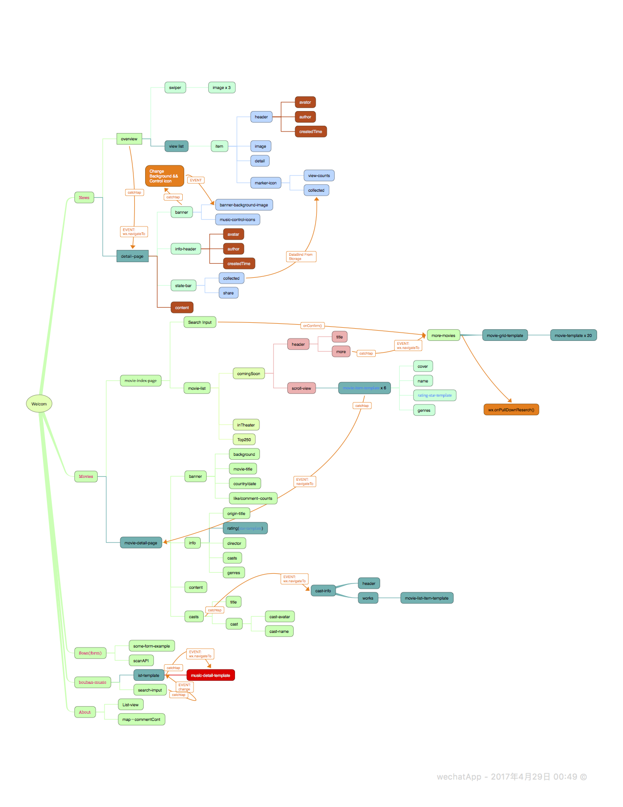
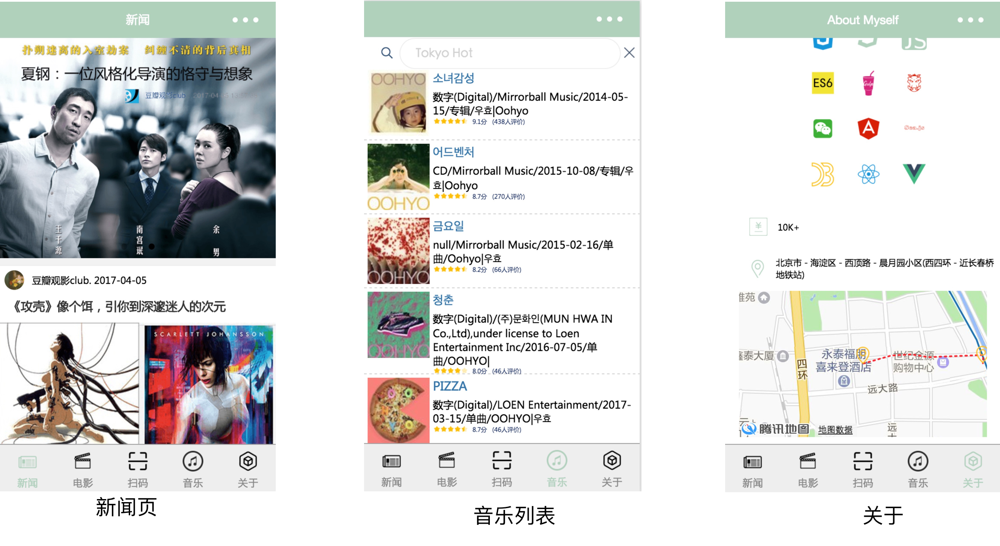

### 说明

1. 目录结构(directory structure)：
    
```
wxApp_Starter//ROOT
├─ app.js//App全局变量及全局参数(global variable & global parameter)
├─ app.json//page()/window参数/tabar设置
├─ app.wxss
├─ data//posts新闻页面虚拟数据(news page virtual data)
│    └─ posts-data.js
├─ pages//pages Root
│    ├─ camera-scan//scan页面表单及摄像头接口示例(form & wxCamera api example)
│    │    ├─ scan.js
│    │    ├─ scan.json
│    │    ├─ scan.wxml
│    │    └─ scan.wxss
│    ├─ douban-music//豆瓣音乐🎵(原豆瓣图书->搜索功能实现|music search page)
│    │    ├─ douban-music.js
│    │    ├─ douban-music.json
│    │    ├─ douban-music.wxml
│    │    └─ douban-music.wxss
│    ├─ douban-films//豆瓣电影🎬（新增影人详情）
│    │    ├─ douban-more-movies//更多电影(more movie)
│    │    ├─ douban-movie-detail//电影详情页(movie detail)
│    │    ├─ douban-movie-grid//电影九宫格－模版(search result page)
│    │    ├─ douban-movie-item//单个电影－模版
│    │    ├─ douban-movie-list//电影列表－模版
│    │    ├─ douban-movie-star//电影评分－模版
│    │    ├─ douban-movies.js//
│    │    ├─ douban-movies.json//
│    │    ├─ douban-movies.wxml//
│    │    └─ douban-movies.wxss//
│    ├─ myself//aboutMyself页面
│    │    ├─ myself.js
│    │    ├─ myself.json
│    │    ├─ myself.wxml
│    │    └─ myself.wxss
│    ├─ posts//新闻页面📰
│    │    ├─ post-detail
│    │    ├─ post-item
│    │    ├─ post.js
│    │    ├─ post.json
│    │    ├─ post.wxml
│    │    └─ post.wxss
│    └─ welcome//欢迎页面👏(welcome page)
│           ├─ welcome.js
│           ├─ welcome.json
│           ├─ welcome.wxml
│           └─ welcome.wxss
├─ source//媒体资源📺
│    ├─ .DS_Store
│    └─ images
│           ├─ .DS_Store
│           ├─ avatar
│           ├─ icon
│           ├─ iqiyi.png
│           ├─ music
│           ├─ post
│           ├─ vr.png
│           └─ wx.png
└─ utils//工具组件🔧
       └─ utils.js
```
2.业务流程图(work flow)
    

3.预览图(preview)
    
    

4.fixed:

    - 2017.4.23:将下拉刷新onPullDownRefresh-->onReachBottom

4.add:

 - 增加专辑详情页💽
 - 增加音乐搜索为空判断


5.版本(dev tool version)：**0.15.12900**

6.API：[doubanAPI v2](https://www.douban.com/group/dbapi/) /[MINA](https://mp.weixin.qq.com/debug/wxadoc/dev/)
